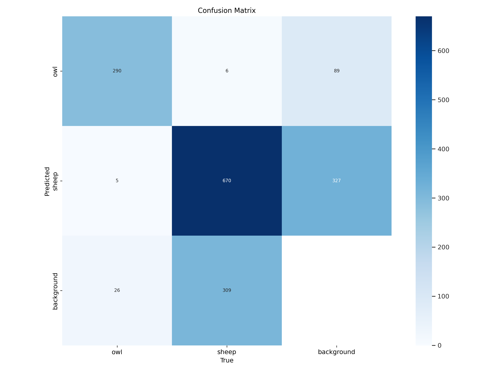
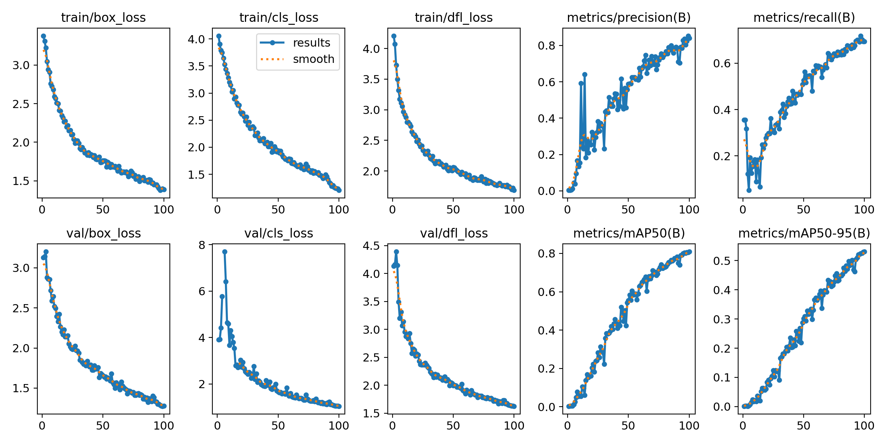
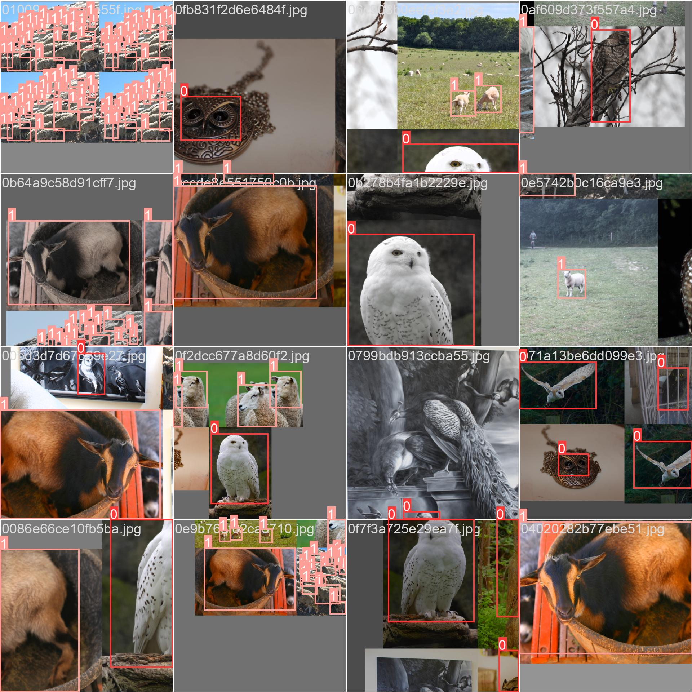
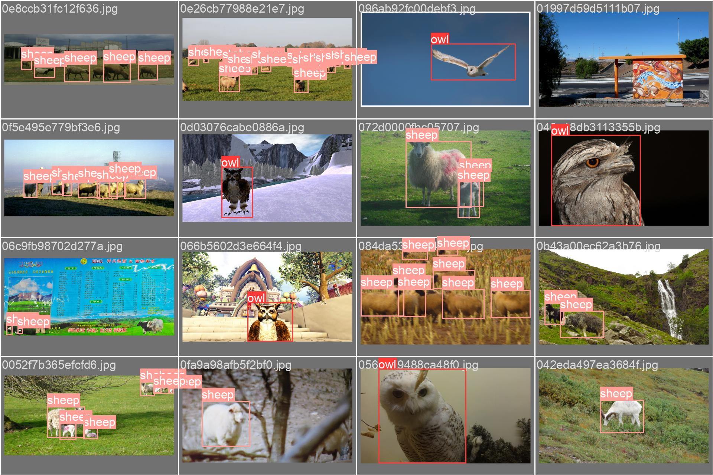
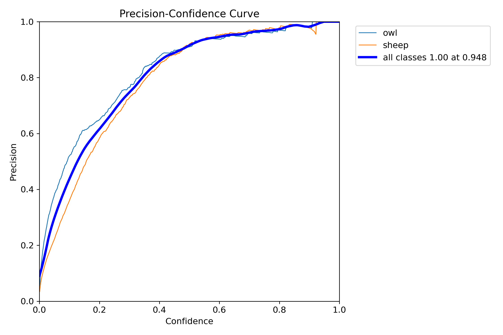

# Owl & Sheep detector

# Table of contents
*[Walkthrough](#walkthrough)
*[Technologies](#Technologies)
*[Results](#evaluate-results)

# Technologies
Project is created with
* OpenImages-v7
* Fiftyone
* Ultralytics
* Yolov8
* Google colab
* Python

# Walkthrough
This project is based on detecting owls and sheep using yolov8 and ultralytics library.

### Step 1.
To start this project you need data, in this project the images from openimages-v7 are used.
In this case we want to download images of owls and sheep.
To start of, open the main.py file and download the fiftyone library.

### Step 2. 
In the main.py file specify the animals in the parameter called "classes" and change the parameter "max_samples" to the amount of desired images.

### Step 3.
Run the code in main.py, this will create a directory called "data" which contains 2 directories called "images" and "labels"

### Step 4. 
The labels and annotations of the downloaded data from openimages-v7 are not corresponding to yolov8.
For this reason you will need to either convert to the yolo format or use www.cvat.ai to annotate your images.

### Step 5
When the annotations are ready store the images in a directory called "train" inside the "images" directory.
The annotations should be stored in a directory called "train" inside the "labels" directory.
This to enable future work such as validation. 

### Step 6
In this step use what is preferred, local och google colab training.
This time google colab was used in the owl-sheep-detect.ipynb

Save your data on the gdrive and mount into the colab file.
Install ultralytics and run the code provided below.
Since the yolov8 is a pretrained model, it will train and store its results in a directory called "runs".

# Evaluate results
To evaluate the results at first we want to se our confusion matrix.
This to see how it reacted to the data provided.
From this matrix we can read out our True positive, True negative, False positive and False negative.

### Confusion Matrix

### Results
To further investigate we want to look at our results diagram where the main focus will be on the losses.
The desired outcome is that our losses are decreasing.

As expected the losses are decreasing which means that the training is successful. 
The pretrained model from yolov8 enables us to extract data by many diagrams which are useful for in-depth analysis of the trained model.

### Image batch check
To furthermore understand what types of images the algorithm used and what outcome it had, we need to check the batch images.

This is to give a more in-depth and visualized understanding of what the algorithm used, this is also much easier presentable to customers who are not fans of diagrams.

## Train images

These images are trained upon with corresponding annotations.

## Validation images

These images are the predicted results.

## Precision
Let's check the precision of the trained model.

The models precision is over 90% which is good.

# Final
As seen on the predicted result image, the model performs well on the trained dataset and the precision is high.

## Further progress
To ensure the quality of the trained model these additional steps should be considered.

* Test images from outside of dataset, never before seen.
* Check overfitting & underfitting
* Check all learning curves on model performance to identify slow convergence or early stopping.
* Assess class imbalance because it can affect on minority classes.
* Expand dataset to more pictures

